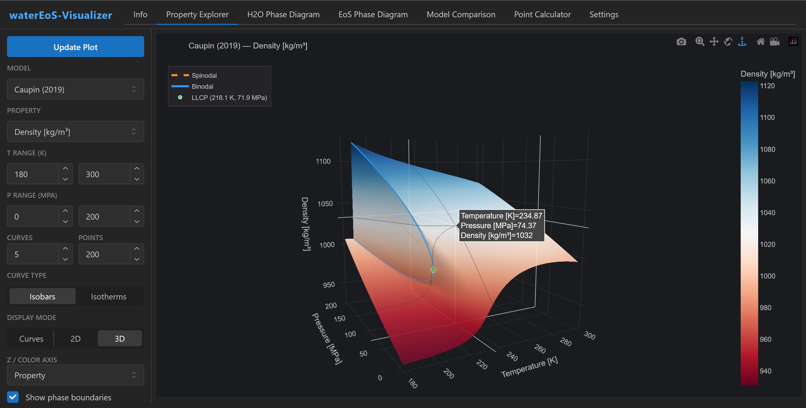
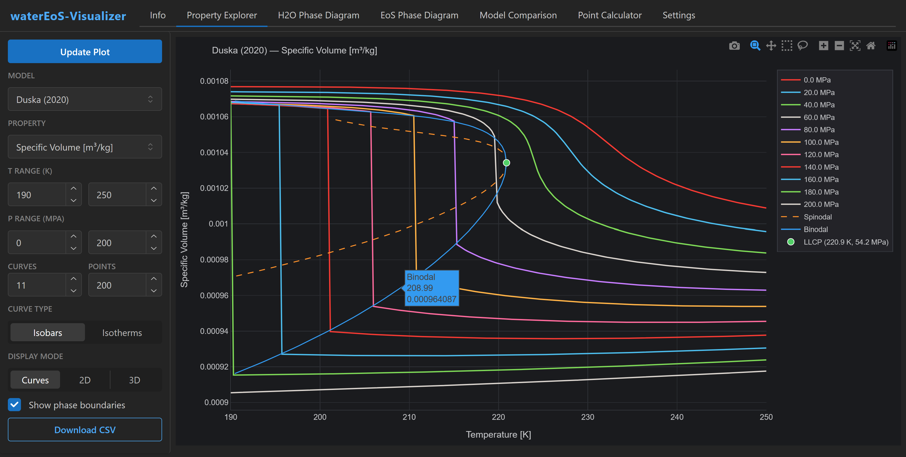
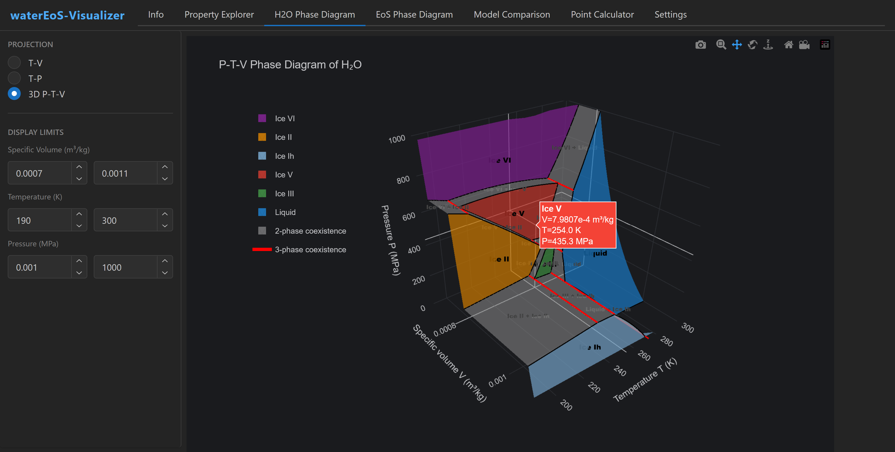

<p align="center">
  
</p>

<p align="center">
  <a href="https://pypi.org/project/waterEoS/"></a>
  <a href="https://www.gnu.org/licenses/gpl-3.0"></a>
  <a href="https://pypi.org/project/waterEoS/"></a>
</p>

## Overview

**waterEoS** is a Rust-accelerated Python package for computing thermodynamic and transport properties of supercooled water. It unifies five equation-of-state models under a single [SeaFreeze](https://github.com/Bjournaux/SeaFreeze)-compatible API.

### Two-state equations of state

Liquid water's thermodynamic anomalies (density maximum, diverging compressibility and heat capacity upon supercooling) can be explained by treating water as a mixture of two interconvertible local structures: a high-density, disordered structure (state A) and a low-density, tetrahedral structure (state B). These "two-state" models predict a liquid-liquid critical point (LLCP) deep in the supercooled regime, below which water can separate into two distinct liquid phases (HDL-rich and LDL-rich). waterEoS implements three such models:

- **Holten, Sengers & Anisimov (2014)** -- The foundational two-state EOS for supercooled water. Uses a Gibbs-energy (pressure-additive) mixing rule, fitted to experimental data at positive pressures up to 400 MPa. Places the LLCP at 228 K, 0 MPa.
- **Caupin & Anisimov (2019)** -- Extends the two-state framework to negative pressures (stretched water), connecting the liquid-liquid spinodal to the liquid-vapor spinodal in a unified description. Places the LLCP at 218 K, 72 MPa.
- **Duska (2020)** -- Uses a volume-additive mixing rule (rather than Gibbs-energy mixing), yielding an explicit equation of state in volume and temperature ("EOS-VaT"). Fitted over a broader temperature range up to 370 K. Places the LLCP at 221 K, 54 MPa.

All three return 43 thermodynamic properties: 15 mixture properties, 14 per state (A and B), plus the tetrahedral fraction *x*.

### Additional models

- **Grenke & Elliott (2025)** -- An empirical Tait-Tammann correlation for supercooled water (not a two-state model). Returns standard thermodynamic properties without per-state decomposition.
- **Singh, Issenmann & Caupin (2017)** -- A two-state transport model that predicts viscosity, self-diffusion coefficient, and rotational correlation time. Uses Holten (2014) as its thermodynamic backbone.

### Performance

The three two-state models and the Grenke model include a compiled **Rust backend** (via PyO3) that is 2-5x faster than the pure Python fallback. Pre-built wheels for Linux, macOS, and Windows are available on PyPI; the Rust backend is selected automatically when present.

## Web App

Try waterEoS interactively at **[watereos-visualizer.up.railway.app](https://watereos-visualizer.up.railway.app)**

The web app includes a Property Explorer, EoS phase diagram viewer, H2O multi-phase diagram, model comparison tool, and point calculator.

<p align="center">
  <br>
  <em>3D density surface for Caupin (2019) with phase boundaries and interactive hover.</em>
</p>

<p align="center">
  <br>
  <em>Specific volume isobars with spinodal, binodal, and LLCP for Duska (2020).</em>
</p>

<p align="center">
  <br>
  <em>3D P-T-V phase diagram of H₂O showing stability fields for liquid water, Ice Ih, II, III, V, and VI.</em>
</p>

## Installation

```bash
pip install waterEoS
```

Pre-built wheels for Linux (x86_64, aarch64), macOS (Intel, Apple Silicon), and Windows include the compiled Rust backend automatically. On other platforms, pip installs from source with a pure Python fallback.

## Quick Start

```python
import numpy as np
from watereos import getProp

# Single point: 0.1 MPa, 300 K
PT = np.array([[0.1], [300.0]], dtype=object)
out = getProp(PT, 'duska2020')
print(f"Density: {out.rho[0,0]:.2f} kg/m³")
print(f"Cp:      {out.Cp[0,0]:.1f} J/(kg·K)")
print(f"x:       {out.x[0,0]:.4f}")
```

### Simple API

For quick calculations without constructing SeaFreeze-style arrays, use `compute()`:

```python
from watereos import compute

out = compute(T_K=300, P_MPa=0.1, model='caupin2019')
print(f"Density: {out.rho[0,0]:.2f} kg/m³")

# Also accepts arrays (evaluates on the full P x T grid)
out = compute(T_K=[250, 275, 300], P_MPa=[0.1, 50, 100], model='holten2014')
# out.rho has shape (3, 3)
```

## Available Models

| Model key | Reference | LLCP (T, P) |
|-----------|-----------|-------------|
| `'holten2014'` | Holten, Sengers & Anisimov, J. Phys. Chem. Ref. Data **43**, 014101 (2014) | 228.2 K, 0 MPa |
| `'caupin2019'` | Caupin & Anisimov, J. Chem. Phys. **151**, 034503 (2019) | 218.1 K, 72.0 MPa |
| `'duska2020'` | Duska, J. Chem. Phys. **152**, 174501 (2020) | 220.9 K, 54.2 MPa |
| `'grenke2025'` | Grenke & Elliott, J. Phys. Chem. B **129**, 1997 (2025) | -- (empirical) |
| `'singh2017'` | Singh, Issenmann & Caupin, PNAS **114**, 4312 (2017) | -- (transport) |
| `'water1'` | SeaFreeze water1 (pass-through) | -- |
| `'IAPWS95'` | SeaFreeze IAPWS-95 (pass-through) | -- |

### Validity Ranges

The three two-state models accept **any** (T, P) input without raising errors, but results are only physically meaningful within the ranges below. The "paper-stated" range is where each model was validated by its authors; the "code-accessible" range is where the code runs without numerical failure (though results outside the paper range may be unphysical).

| Model | Paper-stated validity | Code-accessible range |
|-------|----------------------|-----------------------|
| `'holten2014'` | T_H(P)&ndash;300 K, 0&ndash;400 MPa (extrap. to 1000 MPa) | Unbounded (any T, P) |
| `'caupin2019'` | ~200&ndash;300 K, -140&ndash;400 MPa | Unbounded (any T, P) |
| `'duska2020'` | ~200&ndash;370 K, 0&ndash;100 MPa (extrap. to 200 MPa) | Unbounded (any T, P) |
| `'grenke2025'` | 200&ndash;300 K, 0.1&ndash;400 MPa | Unbounded (any T, P) |
| `'water1'` | 240&ndash;501 K, 0&ndash;2300 MPa | Enforced by SeaFreeze |
| `'singh2017'` | 200&ndash;300 K, 0&ndash;400 MPa (matches Holten backbone) | Unbounded (any T, P) |
| `'IAPWS95'` | 240&ndash;501 K, 0&ndash;2300 MPa | Enforced by SeaFreeze |

**Notes:**
- T_H(P) is the homogeneous ice nucleation temperature (~235 K at 0.1 MPa, ~181 K at 200 MPa).
- Duska (2020) was fitted to data at positive pressures only; negative-pressure extrapolation is unvalidated.
- Caupin (2019) is the only model explicitly validated at negative pressures (stretched water).
- Grenke (2025) is a direct empirical Tait-Tammann correlation, not a two-state model. It has no `x`, `_A`, or `_B` outputs.
- Singh (2017) is a transport properties model that uses Holten (2014) as its thermodynamic backbone. It returns all Holten thermodynamic properties plus `eta`, `D`, and `tau_r`. Its validity range matches Holten (2014).
- `getProp()` and `compute()` issue a `UserWarning` when inputs fall outside the suggested validity range. Results outside these ranges may be unphysical (e.g., negative compressibility or heat capacity).

## Usage

### Grid Mode

Evaluate on a pressure x temperature grid (like SeaFreeze):

```python
import numpy as np
from watereos import getProp

P = np.arange(0.1, 200, 10)    # pressures in MPa
T = np.arange(250, 370, 1)     # temperatures in K
PT = np.array([P, T], dtype=object)

out = getProp(PT, 'holten2014')
# out.rho has shape (len(P), len(T))
```

### Scatter Mode

Evaluate at specific (P, T) pairs:

```python
import numpy as np
from watereos import getProp

PT = np.empty(3, dtype=object)
PT[0] = (0.1, 273.15)    # 0.1 MPa, 273.15 K
PT[1] = (0.1, 298.15)    # 0.1 MPa, 298.15 K
PT[2] = (100.0, 250.0)   # 100 MPa, 250 K

out = getProp(PT, 'caupin2019')
# out.rho has shape (3,)
```

### Individual Model Access

Each model can also be imported directly:

```python
from duska_eos import getProp
from caupin_eos import getProp
from holten_eos import getProp
from grenke_eos import getProp
from singh_viscosity import getProp
```

### List Available Models

```python
from watereos import list_models
print(list_models())
# ['water1', 'IAPWS95', 'holten2014', 'caupin2019', 'duska2020', 'grenke2025', 'singh2017']
```

## Output Properties

All models return an object with the following attributes (the three two-state models also include `x`, `_A`, and `_B` suffixed properties; `grenke2025` returns only the mixture properties):

### Mixture (equilibrium) properties

| Attribute | Property | Units |
|-----------|----------|-------|
| `rho` | Density | kg/m³ |
| `V` | Specific volume | m³/kg |
| `Cp` | Isobaric heat capacity | J/(kg·K) |
| `Cv` | Isochoric heat capacity | J/(kg·K) |
| `Kt` | Isothermal bulk modulus | MPa |
| `Ks` | Adiabatic bulk modulus | MPa |
| `Kp` | Pressure derivative of bulk modulus | -- |
| `alpha` | Thermal expansivity | 1/K |
| `vel` | Speed of sound | m/s |
| `S` | Specific entropy | J/(kg·K) |
| `G` | Specific Gibbs energy | J/kg |
| `H` | Specific enthalpy | J/kg |
| `U` | Specific internal energy | J/kg |
| `A` | Specific Helmholtz energy | J/kg |
| `x` | Tetrahedral (LDL) fraction | -- |

### Per-state properties

Each property above (except `x`) is also available for the individual states with `_A` and `_B` suffixes:
- `rho_A`, `Cp_A`, `vel_A`, ... (State A: high-density / disordered)
- `rho_B`, `Cp_B`, `vel_B`, ... (State B: low-density / tetrahedral)

**Total: 43 output properties** (15 mixture + 14 state A + 14 state B).

All thermodynamic potentials (S, G, H, U, A) are aligned to the IAPWS-95 reference state.

### Transport properties (`singh2017` only)

| Attribute | Property | Units |
|-----------|----------|-------|
| `eta` | Dynamic viscosity | Pa·s |
| `D` | Self-diffusion coefficient | m²/s |
| `tau_r` | Rotational correlation time | s |
| `f` | LDS fraction (= `x` from Holten backbone) | -- |

The `singh2017` model also returns all Holten (2014) thermodynamic properties listed above.

## Phase Diagram

Each model provides functions to compute the liquid-liquid phase diagram:

```python
from duska_eos import compute_phase_diagram

result = compute_phase_diagram()
# result contains: T_LLCP, p_LLCP, T_spin_upper, p_spin_upper,
#                  T_spin_lower, p_spin_lower, T_binodal, p_binodal, ...
```

Available functions: `find_LLCP()`, `compute_spinodal_curve()`, `compute_binodal_curve()`, `compute_phase_diagram()`.

## Performance

Throughput on a 10,000-point grid (100 pressures x 100 temperatures):

| Model | Rust | Python | Speedup |
|-------|------|--------|---------|
| Holten (2014) | 15 ms (678k pts/s) | 34 ms (294k pts/s) | 2.3x |
| Caupin (2019) | 5 ms (1,853k pts/s) | 18 ms (572k pts/s) | 3.2x |
| Duska (2020) | 10 ms (1,040k pts/s) | 52 ms (193k pts/s) | 5.4x |
| Grenke (2025) | 4 ms (2,418k pts/s) | -- | -- |
| Singh (2017) | 32 ms (309k pts/s) | -- | -- |

The Rust backend is used automatically when installed (included in pre-built wheels). Pure Python is used as a fallback.

## References

1. V. Holten, J. V. Sengers, and M. A. Anisimov, "Equation of state for supercooled water at pressures up to 400 MPa," *J. Phys. Chem. Ref. Data* **43**, 014101 (2014). [doi:10.1063/1.4895593](https://doi.org/10.1063/1.4895593)

2. F. Caupin and M. A. Anisimov, "Thermodynamics of supercooled and stretched water: Unifying two-structure description and liquid-vapor spinodal," *J. Chem. Phys.* **151**, 034503 (2019). [doi:10.1063/1.5100228](https://doi.org/10.1063/1.5100228)
   - Erratum: *J. Chem. Phys.* **163**, 039902 (2025). [doi:10.1063/5.0239673](https://doi.org/10.1063/5.0239673)

3. M. Duska, "Water above the spinodal," *J. Chem. Phys.* **152**, 174501 (2020). [doi:10.1063/5.0006431](https://doi.org/10.1063/5.0006431)

4. J. C. Grenke and J. R. Elliott, "Empirical fundamental equation of state for the metastable state of water based on the Tait-Tammann equation," *J. Phys. Chem. B* **129**, 1997-2012 (2025). [doi:10.1021/acs.jpcb.4c06847](https://doi.org/10.1021/acs.jpcb.4c06847)
   - Correction: *J. Phys. Chem. B* **129**, 9850-9853 (2025). [doi:10.1021/acs.jpcb.5c04618](https://doi.org/10.1021/acs.jpcb.5c04618)

5. L. P. Singh, B. Issenmann, and F. Caupin, "Pressure dependence of viscosity in supercooled water and a unified approach for thermodynamic and dynamic anomalies of water," *Proc. Natl. Acad. Sci. U.S.A.* **114**, 4312-4317 (2017). [doi:10.1073/pnas.1619501114](https://doi.org/10.1073/pnas.1619501114)

## Authors

- Anthony Consiglio

## License

This project is licensed under the [GNU General Public License v3.0](LICENSE).
