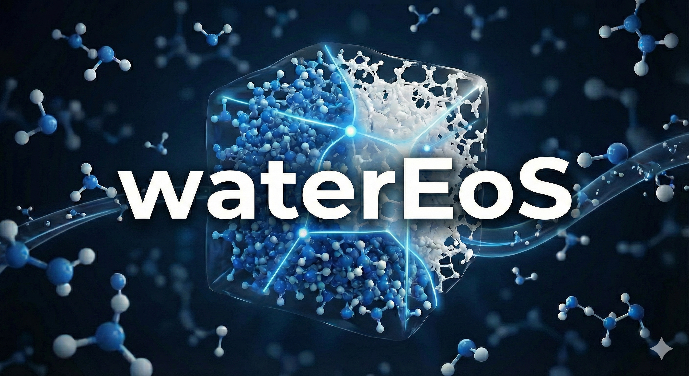
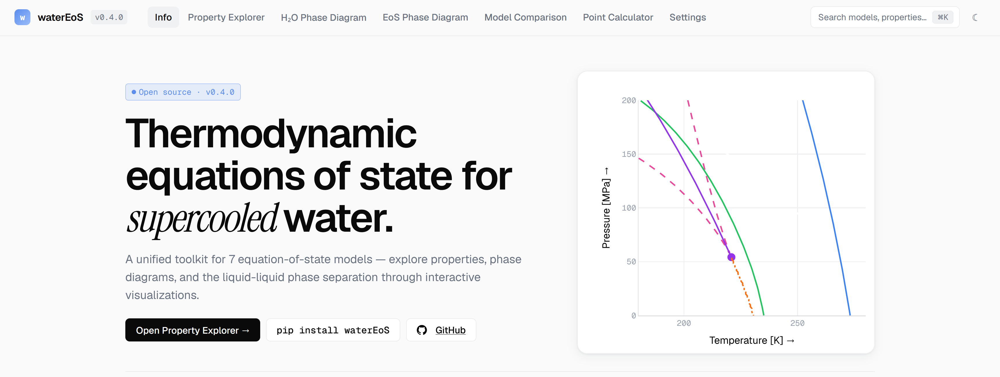
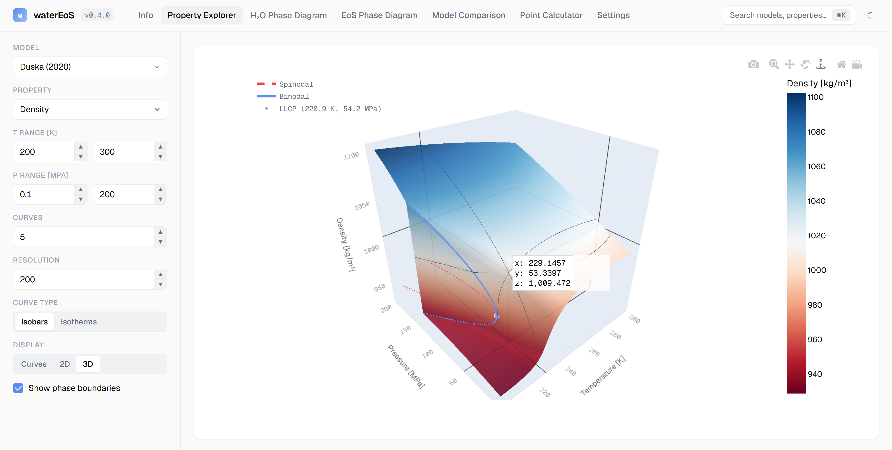
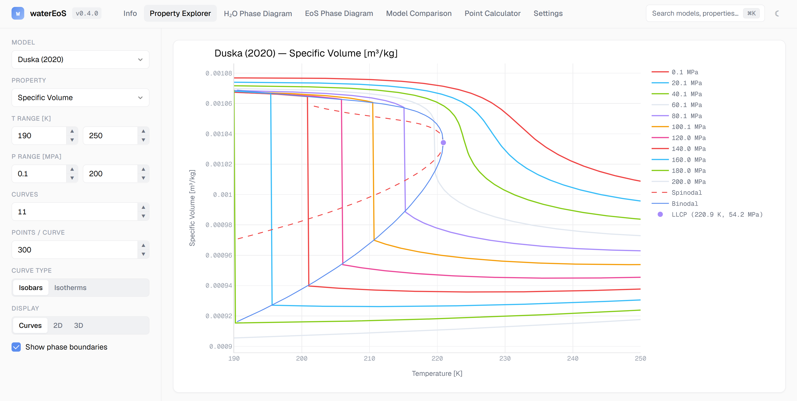
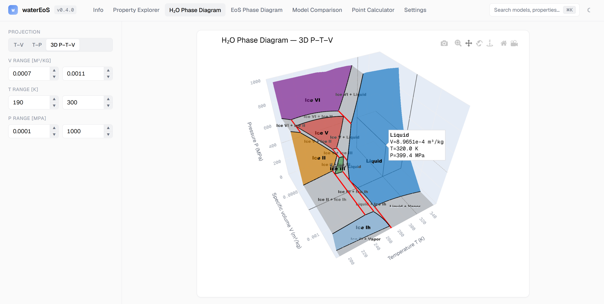

<p align="center">
  
</p>

<p align="center">
  <a href="https://pypi.org/project/waterEoS/"></a>
  <a href="https://www.gnu.org/licenses/gpl-3.0"></a>
  <a href="https://pypi.org/project/waterEoS/"></a>
</p>

## Overview

**waterEoS** is a Rust-accelerated Python package for computing thermodynamic and transport properties of supercooled water. It implements six supercooled-water equation-of-state models &mdash; Holten (2014), Caupin (2019), Duška (2020), Shi & Tanaka (2020), Grenke (2025), and Singh (2017) &mdash; and provides pass-through access to SeaFreeze `water1` and IAPWS-95, all under a single [SeaFreeze](https://github.com/Bjournaux/SeaFreeze)-compatible API.

### Two-state equations of state

Liquid water's thermodynamic anomalies (density maximum, diverging compressibility and heat capacity upon supercooling) can be explained by treating water as a mixture of two interconvertible local structures: a high-density, disordered structure (state A) and a low-density, tetrahedral structure (state B). These "two-state" models predict a liquid-liquid critical point (LLCP) deep in the supercooled regime, below which water can separate into two distinct liquid phases (HDL-rich and LDL-rich). waterEoS implements four such models:

- **Holten, Sengers & Anisimov (2014)** -- The foundational two-state EOS for supercooled water. Uses a Gibbs-energy (pressure-additive) mixing rule, fitted to experimental data at positive pressures up to 400 MPa. Places the LLCP at 228 K, 0 MPa.
- **Caupin & Anisimov (2019)** -- Extends the two-state framework to negative pressures (stretched water), connecting the liquid-liquid spinodal to the liquid-vapor spinodal in a unified description. Places the LLCP at 218 K, 72 MPa. An optional `caupin2019_kim` variant uses the with-Kim parameter set from Table II of the same paper, which incorporates the Kim et al. (2017) X-ray scattering data and places the LLCP at 219 K, 59 MPa.
- **Duska (2020)** -- Uses a volume-additive mixing rule (rather than Gibbs-energy mixing), yielding an explicit equation of state in volume and temperature ("EOS-VaT"). Fitted over a broader temperature range up to 370 K. Places the LLCP at 221 K, 54 MPa.
- **Shi & Tanaka (2020)** -- A hierarchical two-state EOS in which the order parameter is built from a coarse-grained "locally favored structure" fraction. Reproduces the IAPWS-95 liquid surface to ~0.05% in density and places the LLCP well below experimentally accessible temperatures, at 184 K, 173 MPa, so that the observed anomalies are attributed to the two-state feature itself rather than proximity to the critical point.

All four return 43 thermodynamic properties: 15 mixture properties, 14 per state (A and B), plus the tetrahedral fraction *x*.

### Additional models

- **Grenke & Elliott (2025)** -- An empirical Tait-Tammann correlation for supercooled water (not a two-state model). Returns standard thermodynamic properties without per-state decomposition.
- **Singh, Issenmann & Caupin (2017)** -- A two-state transport model that predicts viscosity, self-diffusion coefficient, and rotational correlation time. Uses Holten (2014) as its thermodynamic backbone.
- **Shi & Tanaka (2020) transport** -- A companion transport model (`shi_tanaka2020_transport`) for viscosity, self-diffusion, and rotational relaxation, coupled to the same hierarchical two-state framework as `shi_tanaka2020` rather than to Holten. Returns all `shi_tanaka2020` thermodynamic outputs plus `eta`, `D`, and `tau_r`.
- **SeaFreeze `water1`** -- A pass-through to SeaFreeze's GLBF tensor-product B-spline representation of liquid water (Journaux et al., 2020). Valid 240&ndash;501 K, 0&ndash;2300 MPa.
- **IAPWS-95** -- A pass-through to the IAPWS-95 reference equation of state for ordinary water (Wagner & Pruß, 2002), accessed via the same SeaFreeze GLBF spline machinery. Provides the canonical reference values that the supercooled-water models above are aligned to.

## Web App

Try waterEoS interactively at **[watereos-visualizer.up.railway.app](https://watereos-visualizer.up.railway.app)**

The web app includes a Property Explorer, an EoS phase diagram viewer (per model: spinodals, binodal, LLCP, TMD, Widom line, Kauzmann, ice liquidus, homogeneous nucleation), an **H₂O solid-liquid-vapor phase diagram** with T&ndash;V, T&ndash;P, and 3-D P&ndash;T&ndash;V projections (Liquid + Ice Ih, II, III, V, VI, VII/X + Vapor, with L&ndash;V saturation and Ih&ndash;V sublimation curves), a model comparison tool, and a point calculator.

<p align="center">
  <br>
  <em>The waterEoS web app — a unified toolkit for ten equation-of-state models.</em>
</p>

<p align="center">
  <br>
  <em>3D density surface for Duska (2020) with phase boundaries and interactive hover.</em>
</p>

<p align="center">
  <br>
  <em>Specific volume isobars with spinodal, binodal, and LLCP for Duska (2020).</em>
</p>

<p align="center">
  <br>
  <em>3D P-T-V phase diagram of H₂O showing stability fields for liquid water, Ice Ih, II, III, V, and VI.</em>
</p>

## Installation

```bash
pip install waterEoS
```

Pre-built wheels for Linux (x86_64, aarch64), macOS (Intel, Apple Silicon), and Windows include the compiled Rust backend automatically. On other platforms, pip installs from source with a pure Python fallback.

## Quick Start

```python
import numpy as np
from watereos import getProp

# Single point: 0.1 MPa, 300 K
PT = np.array([[0.1], [300.0]], dtype=object)
out = getProp(PT, 'duska2020')
print(f"Density: {out.rho[0,0]:.2f} kg/m³")
print(f"Cp:      {out.Cp[0,0]:.1f} J/(kg·K)")
print(f"x:       {out.x[0,0]:.4f}")
```

### Simple API

For quick calculations without constructing SeaFreeze-style arrays, use `compute()`:

```python
from watereos import compute

out = compute(T_K=300, P_MPa=0.1, model='caupin2019')
print(f"Density: {out.rho[0,0]:.2f} kg/m³")

# Also accepts arrays (evaluates on the full P x T grid)
out = compute(T_K=[250, 275, 300], P_MPa=[0.1, 50, 100], model='holten2014')
# out.rho has shape (3, 3)
```

## Available Models

| Model key | Reference | LLCP (T, P) |
|-----------|-----------|-------------|
| `'holten2014'` | Holten, Sengers & Anisimov, J. Phys. Chem. Ref. Data **43**, 014101 (2014) | 228.2 K, 0 MPa |
| `'caupin2019'` | Caupin & Anisimov, J. Chem. Phys. **151**, 034503 (2019) | 218.1 K, 72.0 MPa |
| `'caupin2019_kim'` | Caupin & Anisimov, J. Chem. Phys. **151**, 034503 (2019), Table II (with-Kim variant); Kim et al., Science **358**, 1589 (2017) | 219.47 K, 58.74 MPa |
| `'duska2020'` | Duska, J. Chem. Phys. **152**, 174501 (2020) | 220.9 K, 54.2 MPa |
| `'shi_tanaka2020'` | Shi & Tanaka, PNAS **117**, 26591 (2020) | 184 K, 173 MPa |
| `'shi_tanaka2020_transport'` | Shi & Tanaka, PNAS **117**, 26591 (2020), Tables S2/S3 (transport) | 184 K, 173 MPa |
| `'grenke2025'` | Grenke & Elliott, J. Phys. Chem. B **129**, 1997 (2025) | -- (empirical) |
| `'singh2017'` | Singh, Issenmann & Caupin, PNAS **114**, 4312 (2017) | -- (transport) |
| `'water1'` | SeaFreeze water1 (pass-through) | -- |
| `'IAPWS95'` | SeaFreeze IAPWS-95 (pass-through) | -- |

### Validity Ranges

The three two-state models accept **any** (T, P) input without raising errors, but results are only physically meaningful within the ranges below. The "paper-stated" range is where each model was validated by its authors; the "code-accessible" range is where the code runs without numerical failure (though results outside the paper range may be unphysical).

| Model | Paper-stated validity | Code-accessible range |
|-------|----------------------|-----------------------|
| `'holten2014'` | T_H(P)&ndash;300 K, 0&ndash;400 MPa | Unbounded (any T, P) |
| `'caupin2019'` | ~200&ndash;300 K, -140&ndash;400 MPa | Unbounded (any T, P) |
| `'caupin2019_kim'` | ~200&ndash;300 K, -140&ndash;400 MPa | Unbounded (any T, P) |
| `'duska2020'` | ~200&ndash;370 K, ~-150 to 400 MPa (paper-validated 0&ndash;100 MPa; degrades at negative P) | Unbounded (any T, P) |
| `'shi_tanaka2020'` | ~180&ndash;320 K, -110 to 200 MPa (paper-validated; agrees with IAPWS-95 to ~0.05% in ρ and a few % in κ_T, α, Cp across the liquid range) | Unbounded (any T, P) |
| `'shi_tanaka2020_transport'` | ~180&ndash;320 K, -110 to 200 MPa (η, D, τ_R coupled to the same hierarchical two-state framework) | Unbounded (any T, P) |
| `'grenke2025'` | 200&ndash;300 K, 0.1&ndash;400 MPa | Unbounded (any T, P) |
| `'water1'` | 240&ndash;501 K, 0&ndash;2300 MPa | Enforced by SeaFreeze |
| `'singh2017'` | 244&ndash;298 K (limited by homogeneous ice nucleation) | Unbounded (any T, P) |
| `'IAPWS95'` | 240&ndash;501 K, 0&ndash;2300 MPa | Enforced by SeaFreeze |

**Notes:**
- T_H(P) is the homogeneous ice nucleation temperature (~235 K at 0.1 MPa, ~181 K at 200 MPa).
- Duska (2020) was fitted to data at positive pressures only; negative-pressure extrapolation is unvalidated.
- Caupin (2019) is the only model explicitly validated at negative pressures (stretched water).
- Grenke (2025) is a direct empirical Tait-Tammann correlation, not a two-state model. It has no `x`, `_A`, or `_B` outputs.
- Singh (2017) is a transport properties model that uses Holten (2014) as its thermodynamic backbone. It returns all Holten thermodynamic properties plus `eta`, `D`, and `tau_r`. Its validity range matches Holten (2014).
- Shi & Tanaka (2020) is the only two-state model in waterEoS that places the LLCP well below experimentally accessible temperatures (184 K vs ~220 K for Holten/Caupin/Duska); the paper argues that the LLCP has negligible impact on observed anomalies in the liquid regime, which are instead driven by the two-state feature itself.
- `shi_tanaka2020_transport` uses the same hierarchical two-state framework as `shi_tanaka2020` for its dynamic order parameter, so its transport predictions (viscosity, self-diffusion, rotational relaxation) are internally consistent with its own thermodynamics — distinct from `singh2017`, which couples Singh's Arrhenius law to a Holten (2014) thermo backbone.
- `getProp()` and `compute()` issue a `UserWarning` when inputs fall outside the suggested validity range. Results outside these ranges may be unphysical (e.g., negative compressibility or heat capacity).

## Key Concepts

<details>
<summary><strong>Two-state model</strong></summary>

A theoretical framework that treats liquid water as a mixture of two
interconvertible local structures:
- **State A (HDL)** — high-density liquid, disordered hydrogen-bond network
- **State B (LDL)** — low-density liquid, tetrahedral ice-like network

The equilibrium fraction of LDL is denoted **x** (ranges from 0 to 1).
At low temperatures x increases, driving the density anomalies. Outputs
suffixed `_A` and `_B` give individual-state properties; unsuffixed
outputs are the equilibrium mixture.
</details>

<details>
<summary><strong>Liquid–liquid critical point (LLCP)</strong></summary>

The predicted critical point at the top of the liquid–liquid coexistence
dome, analogous to the vapor–liquid critical point but between HDL and
LDL phases. Each two-state model places it at a different (T, P): Holten
at (228 K, 0 MPa), Caupin at (218 K, 72 MPa), Duska at (221 K, 54 MPa),
and Shi & Tanaka at (184 K, 173 MPa). The LLCP has not yet been directly
observed experimentally.
</details>

<details>
<summary><strong>Spinodal</strong></summary>

The thermodynamic stability limit: the curve in (T, P) space where the
compressibility diverges and the free energy has an inflection point. Beyond
the spinodal, the system is unstable and must separate into two phases.
Two-state models have both an **HDL spinodal** and an **LDL spinodal**.
</details>

<details>
<summary><strong>Binodal</strong></summary>

The liquid–liquid coexistence curve (also called the liquid–liquid
transition line, LLTL): the set of (T, P) points where HDL and LDL
have equal Gibbs energy and can coexist in equilibrium. Lies between
the two spinodals.
</details>

<details>
<summary><strong>Temperature of maximum density (TMD)</strong></summary>

The temperature at which water's density reaches a maximum at a given
pressure (equivalently, where the thermal expansivity &alpha; = 0).
At 0.1 MPa this is about 277 K (4 °C). The TMD line shifts to lower
temperatures at higher pressures.
</details>

<details>
<summary><strong>Widom line</strong></summary>

A line of maximum correlation length emanating from the LLCP into the
one-phase region. In practice it is traced as the locus of isobaric
heat capacity (Cp) maxima. It marks the crossover between HDL-like and
LDL-like behavior above the critical pressure.
</details>

<details>
<summary><strong>Kauzmann temperature</strong></summary>

The temperature at which the entropy of the supercooled liquid equals
that of ice Ih at the same pressure. Below this temperature the liquid
would have lower entropy than the crystal — an apparent paradox — so it
serves as a thermodynamic lower bound on the metastable liquid.
</details>

## Usage

### Grid Mode

Evaluate on a pressure x temperature grid (like SeaFreeze):

```python
import numpy as np
from watereos import getProp

P = np.arange(0.1, 200, 10)    # pressures in MPa
T = np.arange(250, 370, 1)     # temperatures in K
PT = np.array([P, T], dtype=object)

out = getProp(PT, 'holten2014')
# out.rho has shape (len(P), len(T))
```

### Scatter Mode

Evaluate at specific (P, T) pairs:

```python
import numpy as np
from watereos import getProp

PT = np.empty(3, dtype=object)
PT[0] = (0.1, 273.15)    # 0.1 MPa, 273.15 K
PT[1] = (0.1, 298.15)    # 0.1 MPa, 298.15 K
PT[2] = (100.0, 250.0)   # 100 MPa, 250 K

out = getProp(PT, 'caupin2019')
# out.rho has shape (3,)
```

### Individual Model Access

Each model can also be imported directly:

```python
from duska_eos import getProp
from caupin_eos import getProp
from holten_eos import getProp
from grenke_eos import getProp
from singh_viscosity import getProp
```

### List Available Models

```python
from watereos import list_models
print(list_models())
# ['water1', 'IAPWS95', 'holten2014', 'caupin2019', 'caupin2019_kim', 'duska2020',
#  'grenke2025', 'singh2017', 'shi_tanaka2020', 'shi_tanaka2020_transport']
```

## Output Properties

All models return an object with the following attributes (the three two-state models also include `x`, `_A`, and `_B` suffixed properties; `grenke2025` returns only the mixture properties):

### Mixture (equilibrium) properties

| Attribute | Property | Units |
|-----------|----------|-------|
| `rho` | Density | kg/m³ |
| `V` | Specific volume | m³/kg |
| `Cp` | Isobaric heat capacity | J/(kg·K) |
| `Cv` | Isochoric heat capacity | J/(kg·K) |
| `Kt` | Isothermal bulk modulus | MPa |
| `Ks` | Adiabatic bulk modulus | MPa |
| `Kp` | Pressure derivative of bulk modulus | -- |
| `alpha` | Thermal expansivity | 1/K |
| `vel` | Speed of sound | m/s |
| `S` | Specific entropy | J/(kg·K) |
| `G` | Specific Gibbs energy | J/kg |
| `H` | Specific enthalpy | J/kg |
| `U` | Specific internal energy | J/kg |
| `A` | Specific Helmholtz energy | J/kg |
| `x` | Tetrahedral (LDL) fraction | -- |

### Per-state properties

Each property above (except `x`) is also available for the individual states with `_A` and `_B` suffixes:
- `rho_A`, `Cp_A`, `vel_A`, ... (State A: high-density / disordered)
- `rho_B`, `Cp_B`, `vel_B`, ... (State B: low-density / tetrahedral)

**Total: 43 output properties** (15 mixture + 14 state A + 14 state B).

All thermodynamic potentials (S, G, H, U, A) are aligned to the IAPWS-95 reference state.

### Transport properties (`singh2017` only)

| Attribute | Property | Units |
|-----------|----------|-------|
| `eta` | Dynamic viscosity | Pa·s |
| `D` | Self-diffusion coefficient | m²/s |
| `tau_r` | Rotational correlation time | s |
| `f` | LDS fraction (= `x` from Holten backbone) | -- |

The `singh2017` model also returns all Holten (2014) thermodynamic properties listed above.

## Phase Diagram

Each model provides functions to compute the liquid-liquid phase diagram:

```python
from duska_eos import compute_phase_diagram

result = compute_phase_diagram()
# result contains: T_LLCP, p_LLCP, T_spin_upper, p_spin_upper,
#                  T_spin_lower, p_spin_lower, T_binodal, p_binodal, ...
```

Available functions: `find_LLCP()`, `compute_spinodal_curve()`, `compute_binodal_curve()`, `compute_phase_diagram()`.

### H₂O solid-liquid-vapor phase diagram

The package also computes the full H₂O solid-liquid-vapor phase diagram (Liquid + Ice Ih, II, III, V, VI, VII/X + Vapor) and emits ready-to-render Plotly figures for the T&ndash;V, T&ndash;P, and 3-D P&ndash;T&ndash;V projections:

```python
from watereos.tv_phase_diagram import (
    compute_tv_phase_diagram,
    plot_tv_phase_diagram_plotly,
    plot_tp_phase_diagram_plotly,
    plot_ptv_phase_diagram_plotly,
)

diagram = compute_tv_phase_diagram(T_min=190, T_max=353.5, dT=1.0)
# diagram contains: phase_fields (per-phase V_min/V_max vs T),
#                   two_phase_bounds (coexistence curves),
#                   invariants (triple points),
#                   saturation (IAPWS-95 L-V), sublimation (IAPWS R14-08 Ih-V).

fig_tv  = plot_tv_phase_diagram_plotly(diagram, V_min=7e-4, V_max=1.1e-3)
fig_tp  = plot_tp_phase_diagram_plotly(diagram, T_min=190, T_max=300,
                                        P_min=1e-4, P_max=1000)
fig_3d  = plot_ptv_phase_diagram_plotly(diagram, V_min=7e-4, V_max=1.1e-3,
                                         P_max=1000)
```

The diagram is built by isothermal convex-hull sweeps in (V, A) space across the SeaFreeze ice phases, `water1`, and an ideal-gas vapor branch anchored at IAPWS-95 saturation. Each common-tangent point is then Newton-refined to the exact analytical condition G<sub>A</sub>(T, P) = G<sub>B</sub>(T, P), so the boundary curves are smooth and free of EoS-discretisation kinks. Three-phase invariants (triple points) are detected from topology changes between adjacent T-slices and rendered as 3-phase coexistence lines.

## Troubleshooting

<details>
<summary><strong>I'm getting NaN or Inf values</strong></summary>

You are likely evaluating outside the model's physically meaningful range.
Check the [Validity Ranges](#validity-ranges) table. Two-state models
accept any (T, P) without raising errors, but they may return `NaN` for
properties that cannot be computed (e.g., speed of sound when the bulk
modulus is negative). Try narrowing your temperature or pressure range,
or switching to a model with a broader validity domain.
</details>

<details>
<summary><strong>I got a UserWarning about temperatures outside the suggested range</strong></summary>

This is expected — `getProp()` and `compute()` issue a warning when inputs
fall outside the model's paper-stated validity range. The computation
still runs, but results may be unphysical. If you are intentionally
extrapolating, you can suppress the warning:

```python
import warnings
warnings.filterwarnings('ignore', message='waterEoS')
```
</details>

<details>
<summary><strong>Results look wrong or differ between models</strong></summary>

Different models are fitted to different data sets and use different
mixing rules, so they will not agree exactly — especially in the deeply
supercooled regime below ~240 K where experimental data is scarce. Use
the [Model Comparison](https://watereos-visualizer.up.railway.app) tool
in the web app to visualize where models diverge. At ambient conditions
(273–373 K, 0.1 MPa), all models agree closely with IAPWS-95.
</details>

<details>
<summary><strong>What are the _A and _B properties?</strong></summary>

Two-state models decompose water into State A (HDL, high-density liquid)
and State B (LDL, low-density liquid). Properties like `rho_A` and
`rho_B` are the densities of the individual states at that (T, P);
`rho` (no suffix) is the equilibrium mixture density. The mixing
fraction `x` gives the fraction of LDL (State B). Only two-state
models (`holten2014`, `caupin2019`, `caupin2019_kim`, `duska2020`,
`shi_tanaka2020`, `shi_tanaka2020_transport`, `singh2017`) provide
these outputs; `grenke2025`, `water1`, and `IAPWS95` do not.
</details>

<details>
<summary><strong>Which backend am I using (Rust or Python)?</strong></summary>

The Rust backend is selected automatically when the compiled extension
is available (included in pre-built PyPI wheels). To check:

```python
from watereos import compute
out = compute(273.15, 0.1, 'duska2020')
# If using Rust, computation is 2-5x faster; no visible difference in output
```

If you installed from source without a Rust toolchain, the pure Python
fallback is used. Results are identical; only speed differs.
</details>

## References

1. V. Holten, J. V. Sengers, and M. A. Anisimov, "Equation of state for supercooled water at pressures up to 400 MPa," *J. Phys. Chem. Ref. Data* **43**, 014101 (2014). [doi:10.1063/1.4895593](https://doi.org/10.1063/1.4895593)

2. F. Caupin and M. A. Anisimov, "Thermodynamics of supercooled and stretched water: Unifying two-structure description and liquid-vapor spinodal," *J. Chem. Phys.* **151**, 034503 (2019). [doi:10.1063/1.5100228](https://doi.org/10.1063/1.5100228)
   - Erratum: *J. Chem. Phys.* **163**, 039902 (2025). [doi:10.1063/5.0239673](https://doi.org/10.1063/5.0239673)

3. M. Duska, "Water above the spinodal," *J. Chem. Phys.* **152**, 174501 (2020). [doi:10.1063/5.0006431](https://doi.org/10.1063/5.0006431)

4. R. Shi and H. Tanaka, "The anomalies and criticality of liquid water," *Proc. Natl. Acad. Sci. U.S.A.* **117**, 26591-26599 (2020). [doi:10.1073/pnas.2008426117](https://doi.org/10.1073/pnas.2008426117) -- Source of both `shi_tanaka2020` (thermodynamic EoS, Table S2 of the SI) and `shi_tanaka2020_transport` (viscosity / self-diffusion / rotational relaxation, Table S3 of the SI).

5. J. C. Grenke and J. R. Elliott, "Empirical fundamental equation of state for the metastable state of water based on the Tait-Tammann equation," *J. Phys. Chem. B* **129**, 1997-2012 (2025). [doi:10.1021/acs.jpcb.4c06847](https://doi.org/10.1021/acs.jpcb.4c06847)
   - Correction: *J. Phys. Chem. B* **129**, 9850-9853 (2025). [doi:10.1021/acs.jpcb.5c04618](https://doi.org/10.1021/acs.jpcb.5c04618)

6. L. P. Singh, B. Issenmann, and F. Caupin, "Pressure dependence of viscosity in supercooled water and a unified approach for thermodynamic and dynamic anomalies of water," *Proc. Natl. Acad. Sci. U.S.A.* **114**, 4312-4317 (2017). [doi:10.1073/pnas.1619501114](https://doi.org/10.1073/pnas.1619501114)

7. B. Journaux, J. M. Brown, A. Pacheco, S. D. Vance, A. Cochrane, T. Bollengier, et al., "Holistic approach for studying planetary hydrospheres: Gibbs representations, ices thermodynamics, transport, and the example of Europa," *J. Geophys. Res.: Planets* **125**, e2019JE006176 (2020). [doi:10.1029/2019JE006176](https://doi.org/10.1029/2019JE006176) -- Source of the SeaFreeze GLBF tensor-product B-spline coefficients used for `water1`, `IAPWS95`, and the ice phases (Ih, II, III, V, VI, VII/X) in the H₂O solid-liquid-vapor phase diagram.

8. W. Wagner and A. Pruß, "The IAPWS Formulation 1995 for the Thermodynamic Properties of Ordinary Water Substance for General and Scientific Use," *J. Phys. Chem. Ref. Data* **31**, 387 (2002). [doi:10.1063/1.1461829](https://doi.org/10.1063/1.1461829) -- Cited as IAPWS-95 throughout; reference EoS for water/vapor used for reference-state alignment and the saturation/triple-point lines in the H₂O phase diagram.

9. W. Wagner, T. Riethmann, R. Feistel, and A. H. Harvey, "New Equations for the Sublimation Pressure and Melting Pressure of H₂O Ice Ih," *J. Phys. Chem. Ref. Data* **40**, 043103 (2011). [doi:10.1063/1.3657937](https://doi.org/10.1063/1.3657937) -- IAPWS R14-08 sublimation pressure correlation used for the Ice Ih/vapor boundary below 273.16 K in the H₂O phase diagram.

## Authors

- Anthony Consiglio &lt;[aconsiglio4@berkeley.edu](mailto:aconsiglio4@berkeley.edu)&gt;

## Citing waterEoS

If you use waterEoS in your research, please cite both this package and the underlying EoS papers. Each model implemented in waterEoS has its own published reference (Holten 2014, Caupin 2019, Duska 2020, Shi & Tanaka 2020, Grenke 2025, Singh 2017, Journaux 2020, Wagner & Pruß 2002) listed in the [References](#references) section above; please cite the original papers for the specific models you use, in addition to this software package.

BibTeX entry for the software package:

```bibtex
@software{consiglio_watereos_2026,
  author       = {Consiglio, Anthony},
  title        = {{waterEoS}: Thermodynamic equations of state for supercooled water},
  year         = {2026},
  url          = {https://github.com/anthony-consiglio/waterEoS},
  version      = {0.6.0},
  license      = {GPL-3.0-only},
}
```

A machine-readable citation in [Citation File Format](https://citation-file-format.github.io/) is also provided in [`CITATION.cff`](CITATION.cff).

## License

This project is licensed under the [GNU General Public License v3.0](LICENSE).
